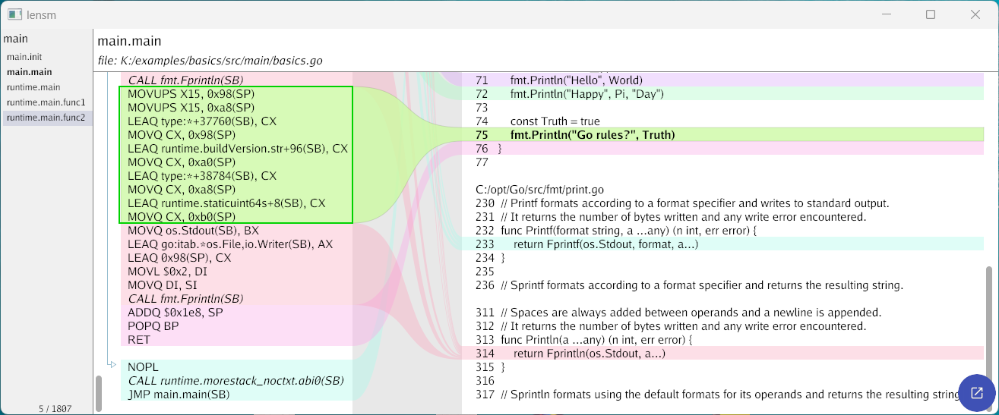

# Go examples [⬆](../README.md#top)

<table style="font-family:Helvetica,Arial;line-height:1.6;">
  <tr>
  <td style="border:0;padding:0 10px 0 0;min-width:120px;"></td>
  <td style="border:0;padding:0;vertical-align:text-top;">Directory <strong><code>examples\</code></strong> contains <a href="https://golang.org/" rel="external" alt="Go">Go</a> code examples coming from various websites - mostly from the <a href="https://golang.org/" rel="external">Go project</a>.</td>
  </tr>
</table>

<!--
TODO: add foot note about
go get github.com/magiconair/properties
-->

## `basics` Example

This example has the following directory structure :

<pre style="font-size:80%;">
<b>&gt; <a href="https://learn.microsoft.com/en-us/windows-server/administration/windows-commands/tree">tree</a> /a /f . | <a href="https://learn.microsoft.com/en-us/windows-server/administration/windows-commands/findstr">findstr</a> /v /b [A-Z]</b>
|   <a href="./basics/build.bat">build.bat</a>
|   <a href="./basics/go.mod">go.mod</a>
|   <a href="./basics/magefile.go">magefile.go</a>
\---<b>src</b>
    \---<b>main</b>
            <a href="./basics/src/main/basics.go">basics.go</a>
</pre>

Command [**`build.bat`**](./basics/build.bat) executes the Go command `%GOROOT%\bin\go build` with the appropriate parameters and runs the generated executable `basics.exe` [1](#footnote_01):

<pre style="font-size:80%;">
<b>&gt; <a href="./basics/build.bat">build</a> -verbose run</b>
Compile 1 Go source file to directory "target"
Execute target "target\basics.exe"
My favorite number is 2
3.141592653589793
55
world hello
7 10
2 true false no!
Type: bool Value: false
Type: uint64 Value: 18446744073709551615
Type: complex128 Value: (2+3i)
Type: int32 Value: 8658
Hello 世界
Happy 3.14 Day
Go rules? true
</pre>

<!--=======================================================================-->

## `hello` Example [**&#x25B4;**](#top)

This example has the following directory structure :

<pre style="font-size:80%;">
<b>&gt; <a href="https://learn.microsoft.com/en-us/windows-server/administration/windows-commands/tree" rel="external">tree</a> /a /f . | <a href="https://learn.microsoft.com/en-us/windows-server/administration/windows-commands/findstr">findstr</a> /v /b [A-Z]</b>
|   <a href="./hello/build.bat">build.bat</a>
|   <a href="./hello/go.mod">go.mod</a>
|   <a href="./hello/magefile.go">magefile.go</a>
|   <a href="./hello/Makefile">Makefile</a>
\---<b>src</b>
    +---<b>main</b>
    |       <a href="./hello/src/main/hello.go">hello.go</a>
    \---<b>test</b>
            <a href="./hello/src/test/hello_test.go">hello_test.go</a>
</pre>

Command [**`build.bat`**](./hello/build.bat) executes the Go command `%GOROOT%\bin\go build` with the appropriate parameters and runs the generated executable `hello.exe` :

<pre style="font-size:80%;">
<b>&gt; <a href="./hello/build.bat">build</a> -verbose run</b>
Compile 1 Go source files to directory "target"
Execute target "target\hello.exe"
hello, world
</pre>

Build tool [`mage.exe`][mage_cli] takes its Makefile-like runnable targets from the Go file [`mage.go`](./hello/mage.go); for instance targets **`clean`** and **`build`** :

> **Note** : Mage supports a makefile-style tree of dependencies using the helper library [`github.com/magefile/mage/mg`](https://magefile.org/dependencies/). To declare dependencies, pass any number of dependent functions to `mg.Deps`.

<pre style="font-size:80%;">
<b>&gt; <a href="https://magefile.org/magefiles/">mage</a> clean build &amp; target\hello.exe</b>
hello, world
</pre>

Adding the Mage option **`-v`** will print some progress messages :

<pre style="font-size:80%;">
<b>&gt; <a href="https://magefile.org/magefiles/">mage</a> -v clean build & target\hello.exe</b>
Running target: Clean
Running target: Build
hello, world
</pre>

Finally, one may also invoke the [Mage target][mage_targets] **`run`** directly (target **`run`** requires at least one argument, thus the dummy argument `0` below):

<pre style="font-size:80%;">
<b>&gt; <a href="https://magefile.org/magefiles/">mage</a> clean run 0</b>
hello, world
</pre>

*WIP*

<!--=======================================================================-->

## Footnotes [**&#x25B4;**](#top)

[1] ***Code disassembling*** [↩](#anchor_01)

<dl><dd>
The Go command <a href="https://pkg.go.dev/cmd/objdump@go1.23.0#pkg-overview"><code>objdump</code></a> prints out the disassembled binary code for the generated executable, e.g. <code>target\basics.exe</code>; here is an excerpt of the <code>main</code> function (source: <a href="./basics/src/main/basics.go"><code>basics.go</code></a>):
</dd>
<dd>
<pre style="font-size:80%;">
<b>&gt; <a href="https://pkg.go.dev/cmd/objdump@go1.23.0#pkg-overview">go tool objdump</a> -S target\basics.exe | <a href="https://man7.org/linux/man-pages/man1/gawk.1.html" rel="external">awk</a> 'BEGIN{n=0}/basics/{n=1}{if (n^>0) print $0}'</b>
TEXT main.main(SB) K:/examples/basics/src/main/basics.go
func main() {
  0x49a800              4c8da42490feffff        LEAQ 0xfffffe90(SP), R12
  0x49a808              4d3b6610                CMPQ R12, 0x10(R14)
  0x49a80c              0f862d060000            JBE 0x49ae3f
  0x49a812              55                      PUSHQ BP
  0x49a813              4889e5                  MOVQ SP, BP
  0x49a816              4881ece8010000          SUBQ $0x1e8, SP
    fmt.Println("My favorite number is", rand.Intn(10))
  [...]
    fmt.Println("Go rules?", Truth)
  0x49adc5              440f11bc2498000000      MOVUPS X15, 0x98(SP)
  0x49adce              440f11bc24a8000000      MOVUPS X15, 0xa8(SP)
  0x49add7              488d0da2950000          LEAQ type:*+37760(SB), CX
  0x49adde              48898c2498000000        MOVQ CX, 0x98(SP)
  0x49ade6              488d0dd3890400          LEAQ runtime.buildVersion.str+96(SB), CX
  0x49aded              48898c24a0000000        MOVQ CX, 0xa0(SP)
  0x49adf5              488d0d84990000          LEAQ type:*+38784(SB), CX
  0x49adfc              48898c24a8000000        MOVQ CX, 0xa8(SP)
  0x49ae04              488d0d7d370c00          LEAQ runtime.staticuint64s+8(SB), CX
  0x49ae0b              48898c24b0000000        MOVQ CX, 0xb0(SP)
       return Fprintln(os.Stdout, a...)
  0x49ae13              488b1d76f70c00          MOVQ os.Stdout(SB), BX
  0x49ae1a              488d05778f0400          LEAQ go:itab.*os.File,io.Writer(SB), AX
  0x49ae21              488d8c2498000000        LEAQ 0x98(SP), CX
  0x49ae29              bf02000000              MOVL $0x2, DI
  0x49ae2e              4889fe                  MOVQ DI, SI
  0x49ae31              e80a83ffff              CALL fmt.Fprintln(SB)
}
  0x49ae36              4881c4e8010000          ADDQ $0x1e8, SP
  0x49ae3d              5d                      POPQ BP
  0x49ae3e              c3                      RET
func main() {
  0x49ae3f              90                      NOPL
  0x49ae40              e8fbeffcff              CALL runtime.morestack_noctxt.abi0(SB)
  0x49ae45              e9b6f9ffff              JMP main.main(SB)
</pre>

<a href=""><code>lensm</code></a> &ndash; a Go assembly and source viewer &ndash; is a nice alternative to view both assembly and source (see post "[Easy to read Golang assembly output?](https://stackoverflow.com/questions/23789951/easy-to-read-golang-assembly-output)" on [stack**overflow**](https://stackoverflow.com/))

<pre style="font-size:80%;">
<b>&gt; <a href="https://go.dev/ref/mod#go-install" rel="external">go install</a> <a href="https://github.com/loov/lensm">loov.dev/lensm@main</a></b>
go: downloading loov.dev/lensm v0.0.6-0.20250304181700-5a7941986854
go: downloading gioui.org v0.8.0
go: downloading golang.org/x/exp/shiny v0.0.0-20240707233637-46b078467d37
go: downloading golang.org/x/image v0.18.0
go: downloading golang.org/x/exp v0.0.0-20240707233637-46b078467d37
go: downloading github.com/go-text/typesetting v0.2.1
go: downloading golang.org/x/sys v0.22.0
go: downloading golang.org/x/text v0.16.0
go: downloading golang.org/x/arch v0.14.0
&nbsp;
<b>&gt; <a href="https://learn.microsoft.com/en-us/windows-server/administration/windows-commands/where" rel="external">where</a> lensm</b>
%USERPROFILE%\go\bin\lensm.exe
</pre>

The following screenshot presents the same assembly code as above :

<pre style="font-size:80%;">
<b>&gt; <a href="https://github.com/loov/lensm">lensm</a> -filter "main" target\basics.exe</b>
</pre>

</dd></dl>

***

*[mics](https://lampwww.epfl.ch/~michelou/)/November 2025* [**&#9650;**](#top)
&nbsp;

<!-- link refs -->

[mage_cli]: https://magefile.org/
[mage_targets]: https://magefile.org/targets/
[windows_batch_file]: https://en.wikibooks.org/wiki/Windows_Batch_Scripting
